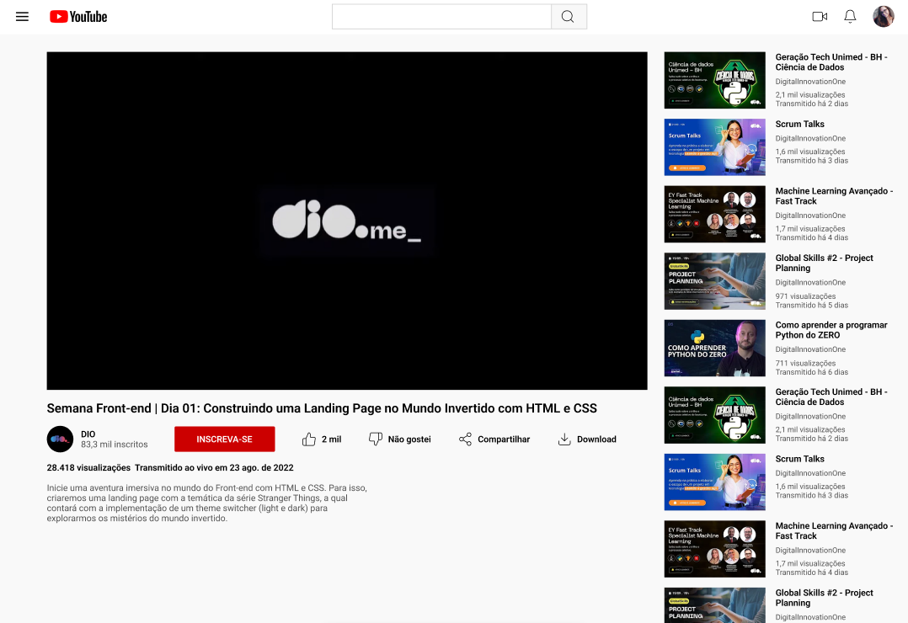

# 🎬 dio-pagina-do-YouTube

Neste desafio, coloquei a mão na massa e **clonei a página inicial do YouTube** utilizando **HTML e CSS**, aplicando principalmente os conceitos de **Flexbox** aprendidos durante o curso da [Digital Innovation One (DIO)](https://www.dio.me/).

O objetivo foi reforçar a prática de posicionamento de elementos, responsividade e estilização com **CSS moderno**.

---

## 🚀 Tecnologias utilizadas

- **HTML5**
- **CSS3**
- **Flexbox**
- **VS Code** (ambiente de desenvolvimento)

---

## 📸 Demonstração

> Exemplo de como ficou o projeto (adicione um print do resultado aqui se quiser):



---

## 📚 Aprendizados

Durante esse desafio, aprendi e pratiquei:

- Estruturação de páginas com **HTML semântico**
- Posicionamento de elementos com **Flexbox**
- Organização de layout semelhante ao do YouTube
- Boas práticas no uso de **CSS Custom Properties**
- Reforço em **responsividade** e estilização

---

## 🛠️ Como executar o projeto

1. Clone este repositório:

   ```bash
   git clone https://github.com/SEU-USUARIO/dio-pagina-do-YouTube.git
   ```

2. Acesse a pasta do projeto:

   ```bash
     cd dio-pagina-do-YouTube
   ```

3. Abra o arquivo index.html no seu navegador.
